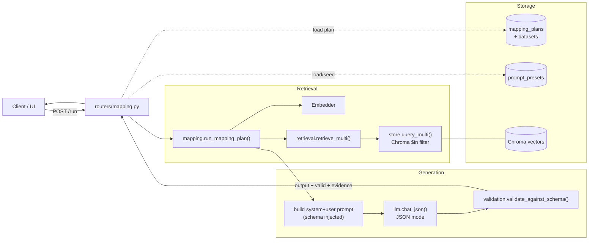
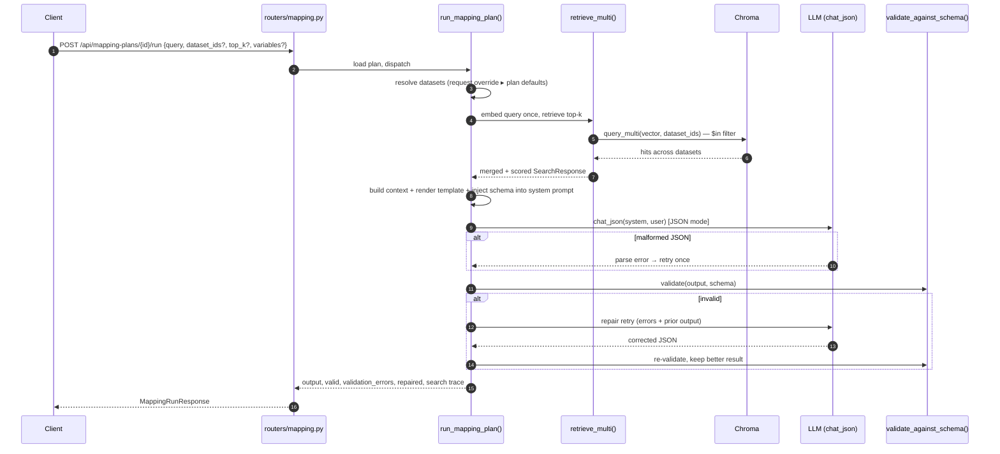
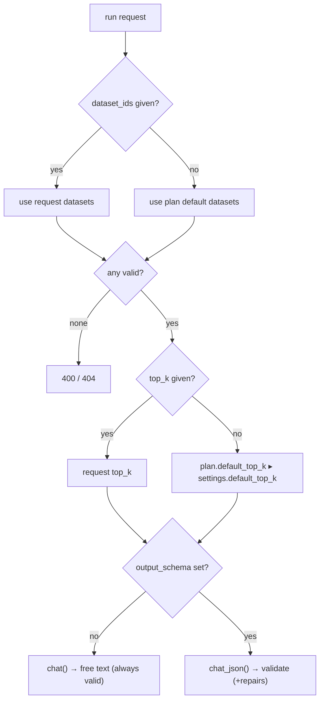
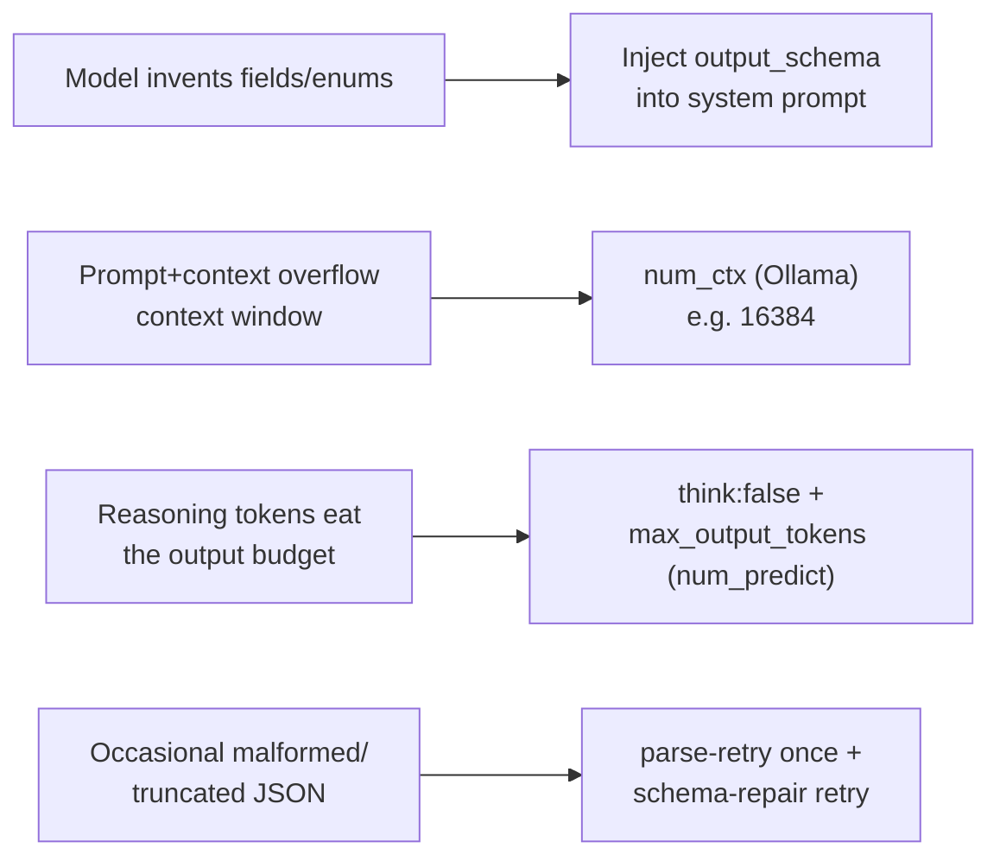
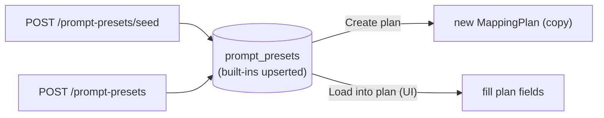

# Mapping Plan Engine

The **Mapping Plan Engine** turns an input query into a **validated, structured output** (e.g. the autism platform's `LearnerInterpretationObject`/LIO), grounded in documents retrieved from **any number of datasets**.

A **mapping plan** is a reusable recipe that bundles:

| Field | Purpose |
|---|---|
| `system_prompt` | The contract the model must follow |
| `output_schema` | Optional JSON Schema used to validate (and repair) the output |
| `prompt_template` | Composes the user message from `{query}`, `{context}`, `{variables}` |
| `default_top_k` / `temperature` | Retrieval + generation defaults |
| default datasets | The dataset set used when a run doesn't override it |

**Prompt presets** are a library of pre-designed `system_prompt` + `output_schema` + `prompt_template` bundles (LIO, Grounded Q&A, Extraction, Summary) you can load into a plan.

---

## 1. Where it sits in the system



---

## 2. Data model

```mermaid
erDiagram
  DATASET ||--o{ MAPPING_PLAN_DATASET : "default selection"
  MAPPING_PLAN ||--o{ MAPPING_PLAN_DATASET : has
  PROMPT_PRESET ||..o{ MAPPING_PLAN : "loaded into (copy)"

  MAPPING_PLAN {
    string id PK
    string name UK
    text   system_prompt
    text   output_schema "JSON string, nullable"
    text   prompt_template
    int    default_top_k
    float  temperature "nullable"
  }
  MAPPING_PLAN_DATASET {
    string id PK
    string mapping_plan_id FK
    string dataset_id FK
  }
  PROMPT_PRESET {
    string id PK
    string key UK
    string name
    text   system_prompt
    text   output_schema "nullable"
    text   prompt_template
    bool   is_builtin
  }
  DATASET {
    string id PK
    string name
  }
```



- `MappingPlanDataset` is a many-to-many association (cascade-deleted with the plan or dataset).
- A `PromptPreset` is **copied** into a plan at creation/load time — editing a plan never mutates the preset, and vice-versa.

---

## 3. Run sequence



### Resolution & fallback rules



---

## 4. Structured-output reliability (LLM tuning)

JSON-mode generation of large objects (like the LIO) on **local reasoning models** (e.g. Qwen3) needs care. The engine + config address four failure modes:



Relevant `llm_config.json` knobs:

| Key | Applies to | Why it matters |
|---|---|---|
| `max_output_tokens` | both (`num_predict` / `max_tokens`) | Large objects get cut off if too low — keep generous (e.g. 8192) |
| `num_ctx` | Ollama | Default window (~4096) can't hold schema + context; 16384 fits the LIO |
| `think` | Ollama | `false` disables reasoning so the whole budget goes to the JSON |

> Implementation note: for Ollama, `num_ctx` + `num_predict` are sent **together** inside one `extra_body.options` dict. Mixing OpenAI's `max_tokens` with a custom `options` dict makes Ollama silently drop `num_predict` and truncate output, so the Ollama path avoids `max_tokens`.

---

## 5. Prompt presets flow



Built-in presets: **LIO** (the main one), **Grounded Q&A (structured)**, **Structured extraction**, **Document summary (free text)**. Built-ins are protected from deletion and refreshed in place on re-seed.

---

## 6. API reference

### Mapping plans
| Method | Path | Purpose |
|---|---|---|
| POST   | `/api/mapping-plans`            | Create |
| POST   | `/api/mapping-plans/seed-lio`   | Seed preset library + create the LIO plan (idempotent) |
| GET    | `/api/mapping-plans`            | List |
| GET    | `/api/mapping-plans/{id}`       | Detail |
| PUT    | `/api/mapping-plans/{id}`       | Update (incl. dataset selection) |
| DELETE | `/api/mapping-plans/{id}`       | Delete |
| POST   | `/api/mapping-plans/{id}/run`   | Execute the mapping |

### Prompt presets
| Method | Path | Purpose |
|---|---|---|
| POST   | `/api/prompt-presets/seed`             | Seed/refresh built-ins |
| GET    | `/api/prompt-presets`                  | List |
| POST   | `/api/prompt-presets`                  | Create custom |
| GET    | `/api/prompt-presets/{id}`             | Detail |
| DELETE | `/api/prompt-presets/{id}`             | Delete (built-ins protected) |
| POST   | `/api/prompt-presets/{id}/create-plan` | New plan pre-filled from a preset |

### Run request / response

```jsonc
// POST /api/mapping-plans/{id}/run
{
  "query": "Learner often looks away and gets frustrated after typing mistakes...",
  "dataset_ids": ["...", "..."],        // optional; falls back to plan defaults
  "top_k": 4,                            // optional
  "variables": { "learner_id": "l_42" } // optional; available as {variables} / {variables.x}
}
```

```jsonc
// 200 OK
{
  "plan_id": "...",
  "output": { /* validated JSON object (or free text) */ },
  "valid": true,
  "validation_errors": [],
  "repaired": false,
  "model": "qwen3.5:latest",
  "provider": "ollama",
  "search": { "hits": [ /* filename, dataset, confidence per hit */ ] }
}
```

---

## 7. Source map

| File | Responsibility |
|---|---|
| `app/mapping.py` | Engine: retrieve → build prompt (schema injection) → `chat_json` → validate → repair |
| `app/retrieval.py` | `retrieve_multi()`, `lookup_datasets_or_raise()` |
| `app/store.py` | `query_multi()` (Chroma `$in`) |
| `app/validation.py` | `check_schema()`, `validate_against_schema()` (jsonschema) |
| `app/llm.py` | `chat_json()`, provider-aware generation limits (`num_ctx`, `num_predict`, `think`) |
| `app/models.py` | `MappingPlan`, `MappingPlanDataset`, `PromptPreset` |
| `app/repository.py` | CRUD + preset upsert helpers |
| `app/seeds.py` | Built-in preset catalog + LIO schema/prompt + seeding |
| `app/routers/mapping.py` | Mapping-plan CRUD + `/run` |
| `app/routers/presets.py` | Preset library + create-plan-from-preset |
| `app/templates/mapping_plans.html`, `mapping_plan.html` | UI (list, edit, run, preset library) |

## 8. Scope (v1)

- JSON Schema validation only — cross-field semantic LIO rules (e.g. "every non-`UNKNOWN` `support_needs` field needs a `field_reasoning` entry") are a planned extension; a hook is left in `app/validation.py`.
- Single LLM provider via `llm_config.json` (no per-plan provider).
- Retrieval merges across datasets by similarity score (no per-dataset quotas/reranking).
