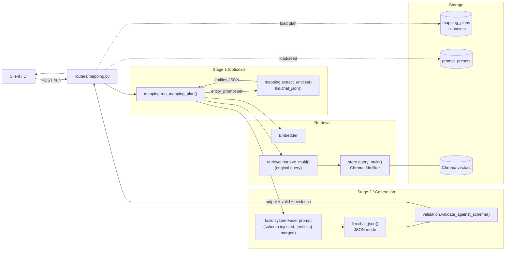
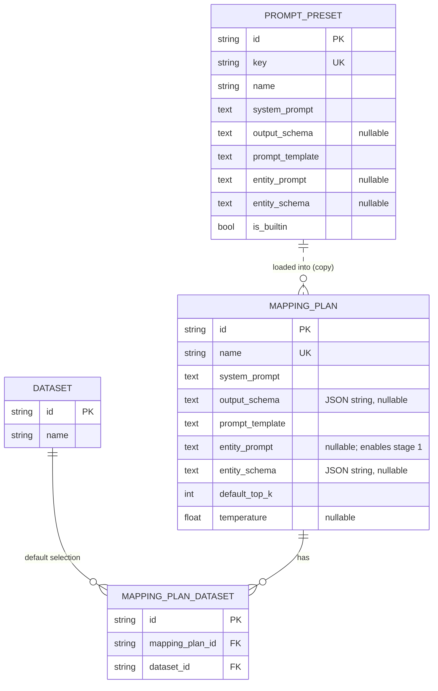
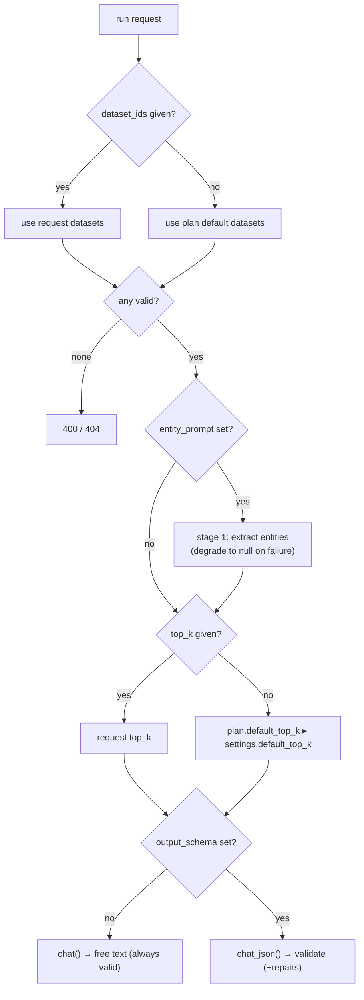
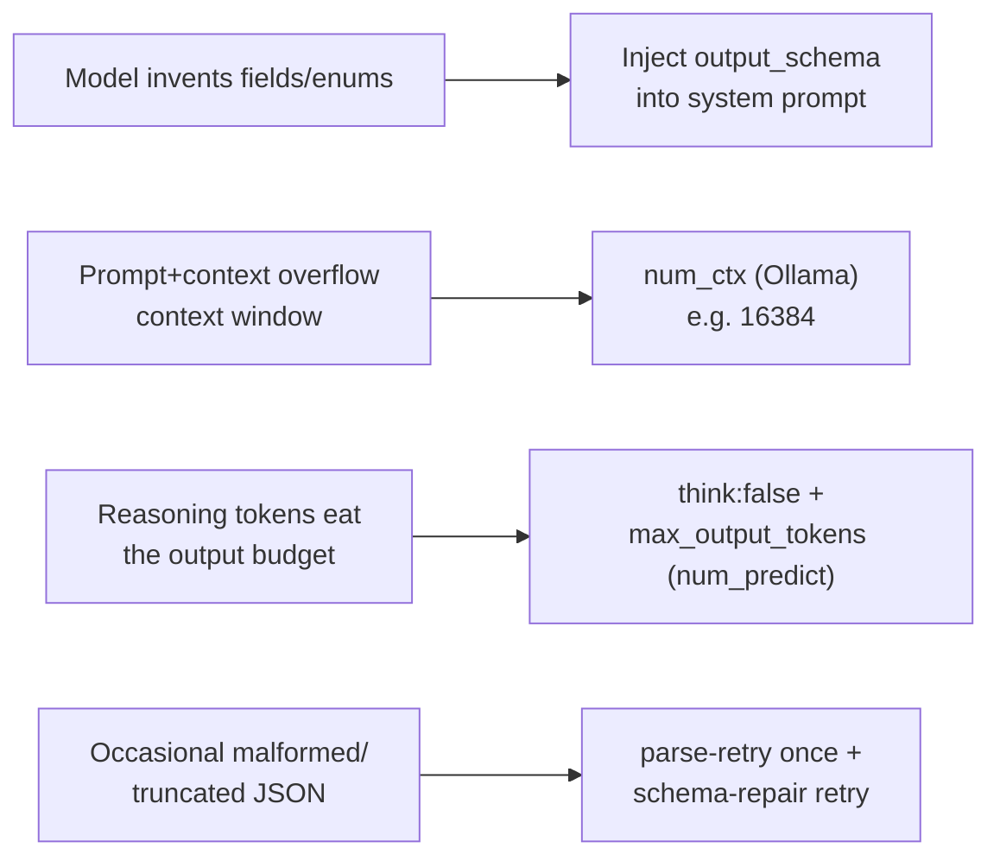
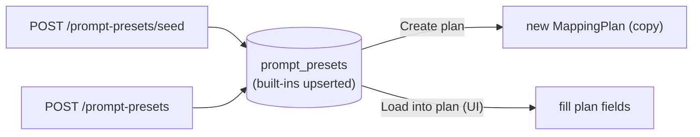

# Mapping Plan Engine

The **Mapping Plan Engine** turns an input query into a **validated, structured output** (e.g. the autism platform's `LearnerInterpretationObject`/LIO), grounded in documents retrieved from **any number of datasets**.

A **mapping plan** is a reusable recipe that bundles:

| Field | Purpose |
|---|---|
| `system_prompt` | The contract the model must follow |
| `output_schema` | Optional JSON Schema used to validate (and repair) the output |
| `prompt_template` | Composes the user message from `{query}`, `{context}`, `{variables}`, `{entities}` |
| `entity_prompt` | Optional **stage-1** instruction; when set, a first LLM pass extracts structured entities |
| `entity_schema` | Optional JSON Schema used to best-effort validate the extracted entities |
| `default_top_k` / `temperature` | Retrieval + generation defaults |
| default datasets | The dataset set used when a run doesn't override it |

**Prompt presets** are a library of pre-designed bundles (system prompt, output schema, prompt template, and optional entity layer) — LIO, Grounded Q&A, Extraction, Summary — you can load into a plan.

When `entity_prompt` is set the engine runs a **two-stage** pipeline: an *entity layer* normalizes the raw input into structured signals first, which are then injected as `{entities}` into the main mapping prompt. Plans without `entity_prompt` run single-stage exactly as before.

---

## 1. Where it sits in the system



---

## 2. Data model



- `MappingPlanDataset` is a many-to-many association (cascade-deleted with the plan or dataset).
- A `PromptPreset` is **copied** into a plan at creation/load time — editing a plan never mutates the preset, and vice-versa.
- `entity_prompt` / `entity_schema` were added after the initial schema. `create_all` only creates missing *tables*, so `db._ensure_columns()` (run from `init_db()`) idempotently `ALTER TABLE … ADD COLUMN`s them on existing SQLite databases.

---

## 3. Run sequence

```mermaid
sequenceDiagram
  autonumber
  participant C as Client
  participant R as routers/mapping.py
  participant E as run_mapping_plan()
  participant L1 as LLM stage 1 (entities)
  participant Rt as retrieve_multi()
  participant S as Chroma
  participant L2 as LLM stage 2 (mapping)
  participant V as validate_against_schema()

  C->>R: POST /api/mapping-plans/{id}/run {query, dataset_ids?, top_k?, variables?}
  R->>E: load plan, dispatch
  E->>E: resolve datasets (request override ▸ plan defaults)
  opt entity_prompt set (stage 1)
    E->>L1: extract entities from raw query + variables (entity_prompt [+entity_schema])
    L1-->>E: entities JSON (parse-retry; best-effort validate)
    note over E,L1: on failure → entities={}, surface entity_error (no hard fail)
  end
  E->>Rt: embed original query once, retrieve top-k
  Rt->>S: query_multi(vector, dataset_ids) — $in filter
  S-->>Rt: hits across datasets
  Rt-->>E: merged + scored SearchResponse
  E->>E: build context + render template ({query},{context},{variables},{entities}) + inject schema
  E->>L2: chat_json(system, user)  [JSON mode]
  alt malformed JSON
    L2-->>E: parse error → retry once
  end
  E->>V: validate(output, schema)
  alt invalid
    E->>L2: repair retry (errors + prior output)
    L2-->>E: corrected JSON
    E->>V: re-validate, keep better result
  end
  E-->>R: output, valid, validation_errors, repaired, entities, entity_error, search trace
  R-->>C: MappingRunResponse
```

### Entity layer (stage 1)

When a plan sets `entity_prompt`, the engine runs a first LLM pass **before retrieval**:

- **Input**: the raw `query` + `variables` only — no retrieved context (the entity layer normalizes the *request*, it does not interpret knowledge).
- **Output**: a structured `entities` JSON object (e.g. for LIO: `observations`, `profile_facts`, `session_context`, `performance_signals`, `constraints`). If `entity_schema` is set it is best-effort validated.
- **Injection**: the entities are available to `prompt_template` as `{entities}` (pretty JSON) and `{entities.field}`.
- **Graceful degradation**: if stage 1 errors or returns invalid JSON, the run *continues* with `entities=null` and an `entity_error` note in the response — it never aborts the mapping.
- **Scope boundary**: the **retrieval query is unchanged** — entities enrich the final mapping prompt, not the vector search. (Using entities to steer retrieval is a possible future extension.)

### Resolution & fallback rules



---

## 4. Structured-output reliability (LLM tuning)

JSON-mode generation of large objects (like the LIO) on **local reasoning models** (e.g. Qwen3) needs care. The engine + config address four failure modes:



Relevant `llm_config.json` knobs:

| Key | Applies to | Why it matters |
|---|---|---|
| `max_output_tokens` | both (`num_predict` / `max_tokens`) | Large objects get cut off if too low — keep generous (e.g. 8192) |
| `num_ctx` | Ollama | Default window (~4096) can't hold schema + context; 16384 fits the LIO |
| `think` | Ollama | `false` disables reasoning so the whole budget goes to the JSON |

> Implementation note: Ollama's **OpenAI-compatible** endpoint (`/v1/chat/completions`) **ignores `num_ctx`** — it silently pins the context window to its small default (~4096), so a large LIO prompt (~3.9k tokens) leaves almost no output budget and the response truncates (`finish_reason=length`) *before any content*. The fix: for `provider: "ollama"` the client calls the **native `/api/chat`** endpoint instead, where `options.num_ctx`, `options.num_predict`, and `think` are honored (and `format: "json"` enforces JSON mode). The OpenAI provider still uses `response_format` + `max_tokens`.

---

## 5. Prompt presets flow



Built-in presets: **LIO** (the main one), **Grounded Q&A (structured)**, **Structured extraction**, **Document summary (free text)**. Built-ins are protected from deletion and refreshed in place on re-seed.

---

## 6. API reference

### Mapping plans
| Method | Path | Purpose |
|---|---|---|
| POST   | `/api/mapping-plans`            | Create |
| POST   | `/api/mapping-plans/seed-lio`   | Seed preset library + create the LIO plan (idempotent) |
| GET    | `/api/mapping-plans`            | List |
| GET    | `/api/mapping-plans/{id}`       | Detail |
| PUT    | `/api/mapping-plans/{id}`       | Update (incl. dataset selection) |
| DELETE | `/api/mapping-plans/{id}`       | Delete |
| POST   | `/api/mapping-plans/{id}/run`   | Execute the mapping |

### Prompt presets
| Method | Path | Purpose |
|---|---|---|
| POST   | `/api/prompt-presets/seed`             | Seed/refresh built-ins |
| GET    | `/api/prompt-presets`                  | List |
| POST   | `/api/prompt-presets`                  | Create custom |
| GET    | `/api/prompt-presets/{id}`             | Detail |
| DELETE | `/api/prompt-presets/{id}`             | Delete (built-ins protected) |
| POST   | `/api/prompt-presets/{id}/create-plan` | New plan pre-filled from a preset |

### Run request / response

```jsonc
// POST /api/mapping-plans/{id}/run
{
  "query": "Learner often looks away and gets frustrated after typing mistakes...",
  "dataset_ids": ["...", "..."],        // optional; falls back to plan defaults
  "top_k": 4,                            // optional
  "variables": { "learner_id": "l_42" } // optional; available as {variables} / {variables.x}
}
```

```jsonc
// 200 OK
{
  "plan_id": "...",
  "output": { /* validated JSON object (or free text) */ },
  "valid": true,
  "validation_errors": [],
  "repaired": false,
  "model": "qwen3.5:latest",
  "provider": "ollama",
  "entities": { /* stage-1 structured entities, or null if no entity layer */ },
  "entity_error": null,                 // non-null note if stage 1 degraded
  "search": { "hits": [ /* filename, dataset, confidence per hit */ ] }
}
```

---

## 7. Source map

| File | Responsibility |
|---|---|
| `app/mapping.py` | Engine: (stage 1) `extract_entities` → retrieve → build prompt (schema injection, `{entities}`) → `chat_json` → validate → repair |
| `app/retrieval.py` | `retrieve_multi()`, `lookup_datasets_or_raise()` |
| `app/store.py` | `query_multi()` (Chroma `$in`) |
| `app/validation.py` | `check_schema()`, `validate_against_schema()` (jsonschema) |
| `app/llm.py` | `chat_json()`, provider-aware generation limits (`num_ctx`, `num_predict`, `think`) |
| `app/models.py` | `MappingPlan`, `MappingPlanDataset`, `PromptPreset` (incl. `entity_prompt`/`entity_schema`) |
| `app/db.py` | `init_db()` + `_ensure_columns()` additive SQLite migration |
| `app/repository.py` | CRUD + preset upsert helpers |
| `app/seeds.py` | Built-in preset catalog + LIO schema/prompt + seeding |
| `app/routers/mapping.py` | Mapping-plan CRUD + `/run` |
| `app/routers/presets.py` | Preset library + create-plan-from-preset |
| `app/templates/mapping_plans.html`, `mapping_plan.html` | UI (list, edit, run, preset library) |

## 8. Scope (v1)

- JSON Schema validation only — cross-field semantic LIO rules (e.g. "every non-`UNKNOWN` `support_needs` field needs a `field_reasoning` entry") are a planned extension; a hook is left in `app/validation.py`.
- Single LLM provider via `llm_config.json` (no per-plan provider).
- Retrieval merges across datasets by similarity score (no per-dataset quotas/reranking).
